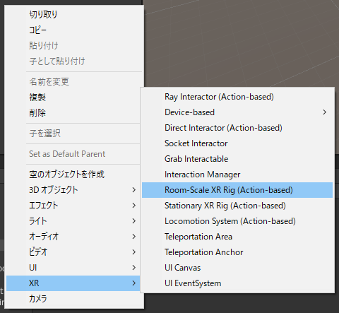
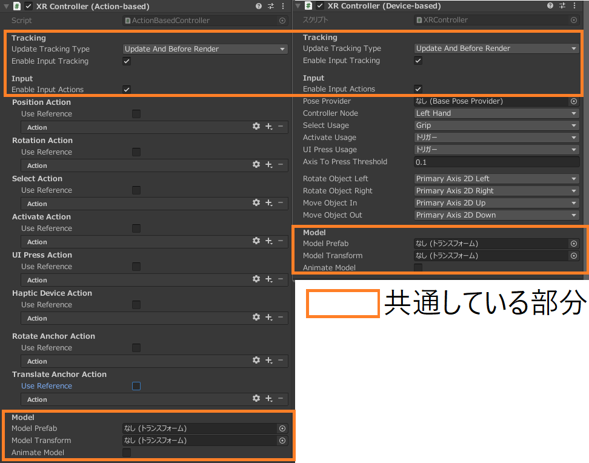
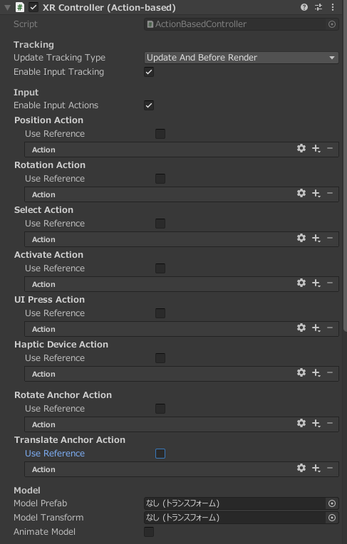
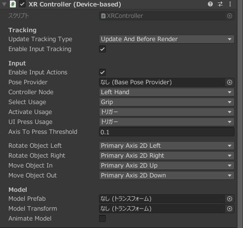
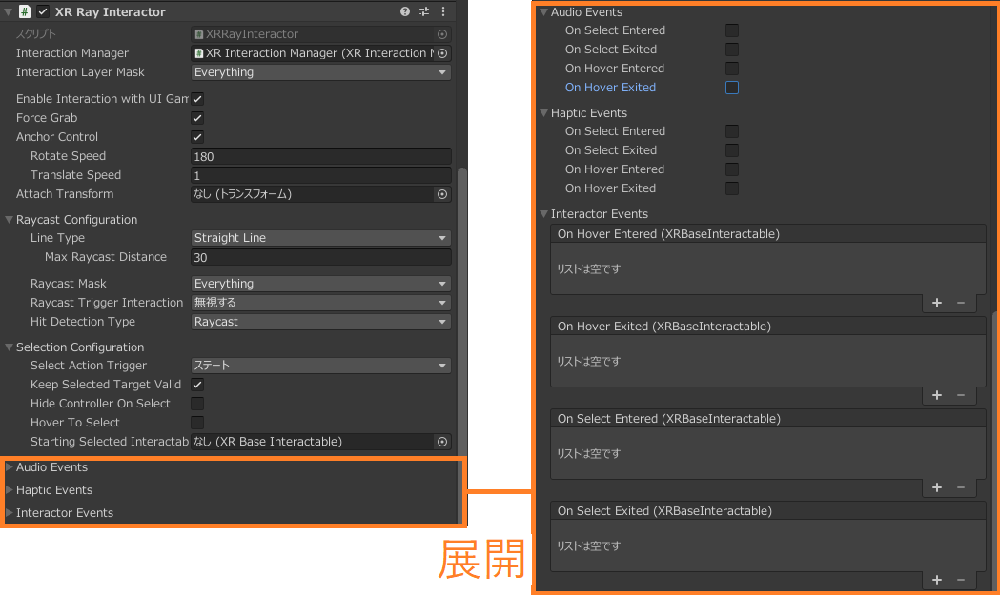
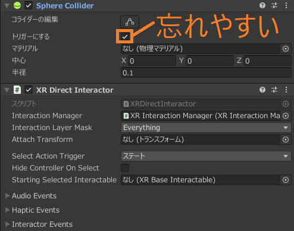
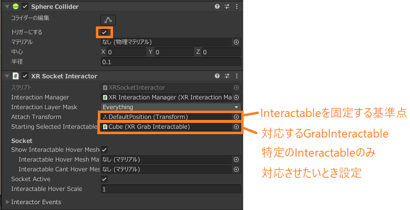

# XR Interaction Toolkit 1.0.0-pre.1をAction-basedで使いたい

## 注

* とりあえず使ってみたいだけだったら、[公式ドキュメント](https://docs.unity3d.com/Packages/com.unity.xr.interaction.toolkit@1.0/manual/index.html)で大丈夫です。
  このドキュメントは、補足的なものになります。
* 実装例が見たい場合は[GitHubの公式リポジトリのサンプル](https://github.com/Unity-Technologies/XR-Interaction-Toolkit-Examples)をご覧ください。(記載時点でちょっと古いですけど)
* 日本語の資料があまりなかったので書きました。品質は期待しないでください。
* XR Interaction Toolkitバージョン1.0.0-pre.1での情報です。
* Action-basedで変わるのは、XR Rig(コントローラとヘッドマウントディスプレイの入力)周りです。  
  その他の部分に関しては以前のバージョンの資料で大丈夫です。
* 質問、わかりにくい記載内容の指摘等あれば、気軽にIssueください。(Pull Requestもウェルカムです)

## 目次

1. そもそも
   1. XR Interaction ToolkitのAction-basedって何？
   2. Input Systemって何？
2. ※ヘッドマウントディスプレイ、コントローラの位置情報、入力関係の機能
   1. ※TrackedPoseDriver
   2. ※XRController
3. Interactor関係の機能
   1. InteractionManager(TODO)
   2. XRBaseInteractor(TODO)
   3. XRBaseControllerInteractor(TODO)
   4. RayInteractor
   5. DirectInteractor
   6. SocketInteractor
4. Interactable関係の機能
   1. XRBaseInteractable(TODO)
   2. SimpleInteractable
   3. GrabInteractable(TODO)
5. UI関係の機能
   1. UI Canvas(TODO)
   2. UI EventSystem(TODO)
6. ※移動、テレポーテーション関係の機能
   1. ※Locomotion System(TODO)
   2. Teleportation Area(TODO)
   3. Teleportation Ancker(TODO)
7. AR関係の機能(TODO)

`※`マークがついている項目はAction-based版がある機能です。

その他の機能はAction-basedとDevice-basedで共通です。  
Device-basedはそこそこ情報が出ているので、このドキュメントを読まなくても良いです。

## 1.そもそも

Action-based以前にXR Interaction Toolkitって何？という方もいると思うので、そのあたりの説明を入れます。  
不要な方は [2.※ヘッドマウントディスプレイ、コントローラの位置情報、入力関係の機能] 以降に進んでください。

### 1-1. XR Interaction ToolkitのAction-basedって何？

XR Interaction Toolkit 0.10.0-preview.1から、Input Systemと連携させることができるようになりました。  
Input Systemを利用する機能は機能名の後ろに`(Action-based)`がつきます。

Input Systemを使用することで、VRコントローラ以外も使用できるようにしたり、特定のコントローラのみキーマッピングを変えるといったことができるようになります。

なお、バージョン0.10.0-preview.1以前の機能は`(Device-based)`が付きます。  
XR Rig周りとLocomotionが変わるだけなので、それ以外の機能に関しては以前のバージョンの資料でも大丈夫です。

## 1-2. Input Systemって何？

新しい入力管理機能です。

ここではざっくり説明します。  
細かい話は、Unity Leraning Materialsの[新しいInputSystemの使い方](https://learning.unity3d.jp/4080/)を見てください。とてもいい動画です。

今までの入力管理機能Input Managerでは入力を得るとき

```C#
using UnityEngine;

class ReadButton: MonoBehaviour
{
    private void Update()
    {
        bool isPushedOkButton = input.GetKeyDown(KeyCode.A);
    }
}
```

と書いていました。
この記法では入力デバイスが増えたときに、増えた分だけ入力の取得と必要に応じて条件分岐を書く必要があります。

Input Systemでは、マッピング用のファイル(Input Actions)を作成することで、入力デバイスとコードを分けて管理することができるようになります。

```C#
using UnityEngine;
using UnityEngine.InputSystem;

// 前もってPlayerInputコンポーネントに作成したInput Actionsを設定しておく
RequireComponent[typeof(PlayerInput)]
class ReadButton: MonoBehaviour
{
    private InputActions _inputActions;

    private void Start()
    {
        // Okという名前のbool型を返すActionを設定した前提
        _inputActions = GetComponent<PlayerInput>().actions["Ok"];
    }

    private void Update()
    {
        bool isPushedOkButton = _inputActions.ReadValue<bool>()
    }
}
```

[参考]【Unity】出来るだけ簡単にNew Input Systemを使いたい - テラシュールブログ  
URL: <http://tsubakit1.hateblo.jp/entry/2019/10/14/215312>

上記のコードでは、キーの情報をInput Actionsの中に隠ぺいでき、どのキーをOkボタンに割り当てているかといった情報が出てきません。  
また、1つのInput Actionsファイルに複数のデバイスを設定することができるため、デバイスの増加に対して、原則コードの書き換えが不要になります。

### 1-2-1. はまったところ Input System

**設定でデバイスを追加したら、マウスの入力を受け付けなくなった。**  
※注: ちゃんと**説明を読んでいなかった**私が悪いです。

`Project Settings` / `Input System Package`に、`Supported Devices`という項目があります。


Supported Devicesの項目ですが、上の写真の英文の通り、

* 空の場合：全てのデバイスの入力を取得
* 何か設定してある場合:設定しているデバイスのみの入力を取得

となっています。

よく読まずに、ここにデバイスを追加し、追加漏れがあった場合、特定のデバイスで上手く動かないといった現象がおきます。

対応デバイスにこだわりがない場合は、Supported Devicesをいじらない方が良いです。

特定のデバイスのみに限定したい場合、特にエディタから動かす時とビルドして動かす時でデバイスが違う場合は、片方の設定が漏れやすいので、それ単体のタスクとして切り分けて行った方が良いでです。(1敗)

---

## 2. ※ヘッドマウントディスプレイ、コントローラの位置情報、入力関係の機能

### 2-1. XR Rig



SteamVR Pluginでいうところの`[CameraRig]`プレハブです。  
以下のような構成になっています。

```txt todo: 画像に差し替え
XRRig(XRRig.cs: カメラのY座標を変更するスクリプト 付)
 └ CameraOffset(スクリプトはついていない。ヘッドマウントディスプレイの高さ反映用のオブジェクト)
    ├ Main Camera(TrackedPoseDriver.cs: ヘッドマウントディスプレイの位置、角度を取得、反映するスクリプト 付)
    ├ LeftHand Controller(RayInteractor, Ray可視化用のスクリプト付)
    └ RightHand Controller(RayInteractor, Ray可視化用のスクリプト付)
```

Main Cameraについている`TrackedPoseDriver`と、[Left / Right]Controllerについている `XRController`はAction-based版とDevice-based版があります。

**既存のメインカメラを勝手に削除**して、XR Rigを生成するというゲームオブジェクトの作り方をします。  
もとからあるメインカメラを消されて困る場合は、退避させるなどの対策をしてください。

XR Rig自体はAction-based、Device-basedともに共通です。


XR Rig.csは`Camera Floor Offcet Object`のLocalPositionを

* Floorモードの時は、(0, 0, 0)
* Deviceモードの時は、(0, `Camera Y Offset`, 0)  
  `Camera Y Offset`はDeviceモードの時のみ設定可能

にするので、プレイヤーを丸ごと移動させたいときには、XR Rigごと移動させる必要があります。  
**`Camera Floor Offcet Object`に設定したオブジェクトの位置はいじらない**ようにしましょう。上書きされます。

ヒエラルキーウィンドウ右クリック / XR でXR Rigを作成する際、Room-ScaleとStationaryの2種類があってどっちを選べばいいかわからないことがあるかもしれません。  
2つの違いは

* Room-Scale XR RigはFloorモード
* Stationary XR RigはDeviceモード

だけです。なので、あとから切り替えするのも楽です。

なお、他にもモードがあるように見えますが、XRRig.cs内では触りません。  
(触れられていないので、わかりません)

### 2-2. TrackedPoseDriver

ヘッドマウントディスプレイのPosition、Rotationを読み込むコンポーネントです。
実はXR Interaction Toolkitの依存パッケージの機能なので、XR Interaction Toolkitを探しても見つかりません。

#### 共通部分 TrackedPoseDriver


上の図のTrackingType(6DoF or 3DoF)とUpdateType(Updateのタイミング)は共通しています。  
どのデバイスのどの部分を使用するか設定する部分が違います。

このコンポーネントはXR対応しており、VRアプリ開発ではVRヘッドマウントディスプレイの、AR Foundationを利用したARアプリ開発ではARグラス、スマートフォンのPosition、Rotationを読み込むことができます。  
また、TrackingTypeで3Dofで使用するか、6DoFで使用するかも設定できます。

XR RigでCameraOffsetのPositionを操作し、TrackedPoseDriverでMainCameraのPosition, Rotationを操作するので、実際どういう動きになるんだ？と思う方もいると思うので、解説します。

XR RigはFloor Mode, Device Mode、TrackedPoseDriverはRotationAndPosition, RotationOnly, PositionOnlyとあります。  
ここではPositionについて話すので、TrackedPoseDriverのRotationAndPositionとPositionOnlyはひとまとめにして説明します。



概要は上の図で理解してもらえると思います。

XR RigはCameraOffset(MainCameraの親)のPositionをFloor Modeで(0, 0, 0)に、Device Modeで(0, `Camera Y Offset`, 0)にします。  
つまり、MainCameraの土台の高さを6DoFを前提として0mとするか、3DoFを前提として`Camera Y Offset`mとするかを設定します。  
TrackedPoseDriverはその土台の上でどうふるまう(3DoFか6DoF)かを設定することになります。

もちろん意図してXR Rig Device ModeとTrackedPoseDriver RotationAndPositionで使用することもできますが、逆に意図していない場合は、カメラの位置が意図した場所からずれるといった問題の原因にもなります。

#### Action-based TrackedPoseDriver


Action-baseのTrackedPoseDriverは`InputSystem.XR`内で実装されています。
[リンク](https://docs.unity3d.com/Packages/com.unity.inputsystem@1.0/api/UnityEngine.InputSystem.XR.TrackedPoseDriver.html)  
ファイルの位置は`Packeages/Input System/InputSystem/Plugin/XR/TrackedPoseDriver.cs`です。

Input Actionsをシリアライズすることができないので、手動で設定していく必要があります。  
Position Action, Rotation ActionはそれぞれVector3, Quaternionしか受け付けないので、マウスやキーボードを設定することはできません。  
マウス等でシミュレーションしたい場合は、Package ManagerのXR Interaction ToolkitのサンプルからSimuratorサンプルをインポートすると参考になると思います。

#### Device-based TrackedPoseDriver


Device-basedのTrackedPoseDriverは`UnityEngine.SpatialTracking`内で実装されています。[リンク](https://docs.unity3d.com/Packages/com.unity.xr.legacyinputhelpers@2.1/api/UnityEngine.SpatialTracking.TrackedPoseDriver.html)  
ファイルの位置は`Packeages/XR Regacy Input Helper/Runtime/TrackedPoseDriver/TrackedPoseDriver.cs`です。

UseRelativeTransformは通常はOFFにします。  
この時、内部的には、デバイスの座標はそのまま処理されます。

(注:コードを読んだだけで使ったことないです。誤りがあるかもしれません)  
TrackedPoseDriverの親を変更せずに、特定の位置を親としたふるまいをさせたい場合はUseRelativeTransformをONにします。  
特定の位置は(Pose型)TrackedPoseDriver.originPoseでアクセスできます。  
内部的には、デバイスの位置を`デバイスのPose.GetTransformedBy(originPose)`として処理しています。

### 2-3. ※XRController

コントローラのPosition, Rotation, ボタン入力を読み込むコンポーネントです。

#### 共通部分 XRController



上の画像の通り、デバイスのPosition、Rotation、ボタン入出力、振動といった、物理的なデバイスの情報に関する項目のUIは変わっていますが、その他の部分に関しては変わっていません。

上の画像でオレンジの線で囲んだ共通部分の話をします。

TrackingのUpdateTrackingTypeはどのタイミングで、デバイスの位置情報を取得するかの設定になります。  
それぞれの項目の違いは処理を呼ぶタイミング(Update or BeforeRender)と回数(UpdateAndBeforeRender or else)だけで、処理自体は同一です。  
また、EnableInputTrackingはデバイスのトランスフォームの更新をするかどうかの設定になります。

InputのEnableInputActionsはEnableInputTracking同様、コントローラーのボタン入力を受け付けるがどうかの設定になります。

Modelに関しては使ったことがないので、はっきりしたことは言えないのですが、おそらくコントローラーのモデルなどはここにセットするのが正規の実装になると思われます。(今までゲームオブジェクトにプレハブくっつけてました...)
コードを読む限り、モデルのプレハブをModelPrefabに設定すると、ModelTransformの子として、モデルがインスタンス化され、必要に応じて(AnimateModel)設定されたアニメーションが実行される要です。

#### Action-based XRController



Action-basedのXRControllerはInputSystem.XR内で実装されています。[リンク](https://docs.unity3d.com/Packages/com.unity.inputsystem@1.0/api/UnityEngine.InputSystem.XR.XRController.html)

コントローラのキーマッピングを行う機能(UseRefarence)がついていますが、そのためにInput Actionsファイルを要求します。  
UseRefarenceを使わずAction横の`＋`ボタンから追加することもできますが、Input Actionsファイル作成とほぼ同じ作業をしないといけないので、おとなしくInput Actionsファイルを作りましょう。

Input Actionsファイルの作成は結構面倒(単純作業だけど量が...)かつ、バグを埋め込みやすい(経験談)ので、Package ManagerのXR Interaction ToolkitのサンプルからDefault Input Actionsサンプルをインポートして、改変していくことをお勧めします。

#### Device-based XRController



Device-basedのXRControllerはXR Interaction Toolkit内で実装されています。[リンク](https://docs.unity3d.com/Packages/com.unity.inputsystem@1.0/api/UnityEngine.InputSystem.TrackedDevice.html)

かなりUIが直観的でわかりやすいので、多分画像の各項目を見たら大体のことはわかると思います。  
実際それ以上の情報は出せないので、この項目は終わりです。

---

## 3. Interaction関係の機能

XR Interaction Toolkitのインタレクションは関数を呼ぶ〇〇Interactorと、呼ばれる関数を設定している〇〇Interactableの組で構成されています。  
Interactorで取得したオブジェクトに対になるInteractableが設定されている場合(InteractionManager経由で確認)、そのInteractableを呼ぶといった動作をします。

用意されているInteractor以外の機能が必要な場合は、XRBaseControllerInteractorやXRBaseInteractorを継承して新たにスクリプトを書くことで、オリジナルのコンポーネントを作成できます。  
なお作成する場合は、DirectInteractorが一番シンプルなのでDirectInteractorのコードを参考にするのがよいと思います。

用意されているInteractableはTransformをいじる程度の機能しか用意されていません。  
機能の拡張をしたい場合は、〇〇Interactableを継承して機能を追加するか、XRBaseInteractableを継承してオリジナルのコンポーネントを作成することができます。

### 3-1. InteractionManager

InteractorやInteractableの情報を格納するクラスです。  
Hoverしたかといった、パッシブな(ボタンを押したなどのアクティブでない)場合の機能の実行や、Interactorから、今ヒットしたオブジェクトはInteractableかどうかの問い合わせに対応します。

TODO: 細かいところを追記

### XRBaseInteractor

SocketInteractor, XRBaseControllerInteractorの継承元です。  
独自のコントローラを必要としないInteractorを作成したい場合は、これを継承して作ることになります。

注意点として、1オブジェクトにアタッチできるInteractorは1つまでです。  
複数付けたい場合は、両方の機能を持ったInteractorを自作する必要があります。

todo

### XRBaseControllerInteractor

RayInteractor, DirectInteractor, GrabInteractorの継承元です。
コントローラからの入力を受け取るInteractorを作成したい場合は、これを継承して作ることになります。

todo

### 3-2. RayInteractor



RayInteractorはSellectに割り当てられたボタンが押された時、レイキャストを飛ばし、一番手前のオブジェクトを取得する機能です。  
一番手前のオブジェクトにInteractable系コンポーネントが設定してある場合、そのInteractableを動作させます。

また、UI操作機能(UIInteractor)がついている唯一のInteractorです。UIを操作する機能を作りたい場合はこれを参考にすると良いです。

特にはまるところはありません。

Ray自体は不可視なので、LineRenderer、XRInteractorLineVisualと併用することで、飛ばしているレイを可視化して、使用者が認識しやすいようにすることもできます。

### 3-3. DirectInteractor



DirectInteractorはSellectに割り当てられたボタンが押された時、同じゲームオブジェクトにアタッチされているコライダーをトリガーとして、トリガーのコライダーに接触しているオブジェクトを取得する機能です。  
取得したオブジェクトにInteractable系コンポーネントが設定してある場合、そのInteractableを動作させます。  

上の画像ではSphereColliderを使用していますが、コライダーだったらなんでもいいです。

**はまりやすいポイント**

* コライダーと同時利用
* コライダーの`トリガーにする`設定をオンにする

といった部分が自分で設定するときに忘れやすいポイントになります。  
`Direct Interactor does not have required Collider set as a trigger.`というエラーが出たらこの部分の設定が上手くできていません。

### 3-4. SocketInteractor



公式で用意しているInreractorの中で、唯一Controllerを利用しない機能です。  
コントローラ以外でInteractableを動作させたい場合にはこのスクリプトを参考に実装すると良いと思います。

同じゲームオブジェクトにコライダーをトリガーとして設定しておいて、対応するGrab Interactableがコライダーと接触したとき、そのGrab Interactableを動作させます(移動させます)。  
接触したオブジェクトの位置をAttachedTransformに設定するInteractorなので、移動機能が実装されているGrab Interactableのみを対象とします。

Attached TransformはInteractableを設置する位置として使用されます。  
Starting Selected Interactableは特定のInteractableのみに反応してほしい時に設定する項目になります。

はまりやすいポイントは、DirectInteractorと同様です。

**はまりやすいポイント**

* コライダーと同時利用
* コライダーの`トリガーにする`設定をオンにする

といった部分が自分で設定するときに忘れやすいポイントになります。

### XRBaseInetractoable

Interactableの元となるabstractクラスです。  
独自のInteractableを作成したい場合は、これらを継承して作ることになります。

todo

### SimpleInteractable

XRBaseInetractoableを継承しただけのInteractableです。  
XRBaseInetractoableがどういう機能を持っているかUnity Editor上で見たい時、トリガーとしての機能が欲しいだけの時に便利です。

全てXRBaseInetractoableと同じなので、詳しくはXRBaseInetractoableの項目を読んでください。

ほんとに実装これだけなんで。

```C#
public class XRSimpleInteractable : XRBaseInteractable{}
```

### GrabInteractable

---

## 4. UI関係の機能

### 4-1. UI Canvas

### 4-2. UI EventSystem

---

## 5. ※移動、テレポーテーション関係の機能

### 5-1. ※Locomotion System

todo: 画像

#### 共通部分 Locomotion System

#### Action-based Locomotion System

#### Device-based Locomotion System

### 5-2. Teleportation Area

todo: 画像

#### 共通部分 Teleportation Area

#### Action-based Teleportation Area

#### Device-based Teleportation Area

### 5-3. Teleportation Ancker

---

## 6. AR関係の機能(TODO)

余裕があったら書きます。
