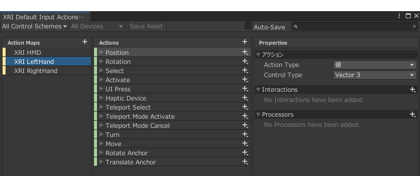
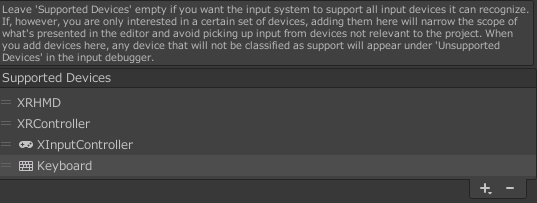
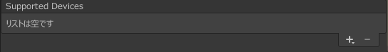

# XR Interaction ToolkitがInput Systemを使うようになったぞ

yusuke ota

---

## 自己紹介

* 名前: yusuke ota
* 職種: 一般事務
* 言語: Rust, C#

近況

* ハードディスクが壊れました(このスライドは第2版)

---

## 注

* XR Interaction Toolkit, Input SystemはUnityの機能です
* VRの話のみです。ARの話はしません
* XR Interaction Toolkit 1.0.0-pre.1の話です

---

## 目次

1. 前情報
1. 本題
1. はまりどころ
1. まとめ
1. 参考文献

---

## 前情報

---

### Input Systemって何

Unityの新しい入力制御機能(Input Managerの代わり)

コントローラーのバインディングとかしてくれる便利機能  
キーボード、ゲームパッド、VR コントローラー等様々なデバイスに対応

---

詳しくはUnity Leraning Materialsの[新しいInputSystemの使い方](https://learning.unity3d.jp/4080/)を見て

---

### XR Interaction Toolkitって何

---

#### UnityEngine.XR.Subsystem

[画像引用]Unity XRプラットフォームの最新情報
<https://blogs.unity3d.com/jp/2020/01/24/unity-xr-platform-updates/>

---

#### XR Interaction Toolkit

XR.Subsystemをラッピングしつつ、  
コントローラのインタラクションを実装を簡単にするパッケージ

---

#### メリット(各社SDK -> XR Interaction Toolkit)

* PCVR用のアプリケーションが１プロジェクトで管理できるようになる
* PCVRとスタンドアローンで**スクリプト**が**ある程度**共有できる

---

##### Q: PCVR用のプロジェクトをそのままQuest向けにコンバートできないの?

A: 難しいです。(動作の軽さによる)

* スクリプト: 環境独自の機能を使っていない場合は、ほぼ移行できる。(場合によっては最適化が必要)
* グラフィック: モデルの軽量化、半透明オブジェクトの削除、シャドーのベイクetc すごく大変

---

#### デメリット(各社SDK -> XR Interaction Toolkit)

* 各デバイスの独自機能が使用できない(ex: Questのハンドトラッキング)
* 各SDKの専用機能が使用できない(ex: Oculusの解像度変更機能)

特にQuestは独自機能が多いので、いろいろとつらい  
OpenVRがちょっとクラッシュしたりした(半年前)り、MockHMD XRが壊れていた(1週間前)り、各デバイスのSDKがまだ不安定な感じを受ける。人柱を待って

---

## XR Interaction ToolkitがInput Systemを使うようになった(本題)

XR Interaction Toolkit 0.10.0-preview.1から、Input System**も**使えるようになった  
以前の機能(Device-based)も利用できるのですでに使っている人も安心

これから使う人は...わかるよね?

---

### こんなところが便利になった(0.9.4 -> 1.0.0)

Input SystemによってVRコントローラ以外も使えるようになった

package managerからインポートできるSimuratorは  
キーボードの入力とコントローラの入力を同一のものとして利用している

---

### Input Systemの設定大変じゃない?

公式サンプル(package manager側)を使いましょう

---

### 公式サンプル(package manager側)中身

package managerからインポートできるサンプル  
~~サンプル？ただの設定ファイルの間違いじゃ...~~

* Default Input Actions
  XRController(Action-based)用Input Actions Asset(コントローラベース)
  Interactorの設定ファイル群
* XR Device Simulator
  XRController(Action-based)用Input Actions Asset(キーボードベース)
  デバイスシミュレーション用のPrefab

---

## はまったところ

基本的には、公式サンプルを使用すれば問題ない。  
自分で1から設定する場合は、参考になるかも

---

### Hapticってどうやって設定するの？

> The Controller and Interactor have limited support for haptic feedback. To enable haptic feedback for an XR Controller (Action-based), specify a Haptic Device Action with a binding path to an active control, such as <XRController>{LeftHand}/*.

引用: XR InteractionToolkit 1.0.0-pre.1公式ドキュメント Controller/Interactor
<https://docs.unity3d.com/Packages/com.unity.xr.interaction.toolkit@1.0/manual/index.html#controllerinteractor>

`<コントローラーの種類>{LeftHand or RightHand}/*`で設定する
(ex: `<XRController>{LeftHand}/*`)

これを初見で理解できる人いるの...

---

### Button(Canvas)がクリックを認識しなくなった

ボタンをトリガーとした機能の確認をEditerの再生で行っていた。
が、いろいろ設定をいじった時ボタンがマウスのクリックを認識しなくなった。

原因:

* Project Settings/Input System Package/Supported Devicesを設定するとき
  使用するデバイスを追加していなかった

対処:

* 使用するデバイスを全部Supported Devicesに追加する
* Supported Devicesに何も設定しない(取得できる入力をすべて取得する)

そもそもXR Plug-in Managementの設定を行えば、Editer PlayからPCVRで再生が可能  
(Android VR向けプロジェクトのEditer PlayをOculus Linkで確認したり)

---

before

after

---

## まとめ

* XR Interaction Toolkitはデバイスの互換性を考えたい場合には便利
* Input SystemでVR コントローラ以外もバインドできるようになった
* Input Systemの設定が面倒なので、Package Managerからインポートしよう

* Plugin 周りでバグに出会うこともあるので、覚悟しよう

---

## 参考文献

### XR Interaction Toolkit

* XR Interaction Toolkit公式ドキュメント
  <https://docs.unity3d.com/Packages/com.unity.xr.interaction.toolkit@1.0/manual>
* XR-Interaction-Toolkit-Examples(公式サンプル) 注:バージョン 0.10.0-preview.7
  <https://github.com/Unity-Technologies/XR-Interaction-Toolkit-Examples>

### Input System

* Input System公式ドキュメント
  <https://docs.unity3d.com/Packages/com.unity.inputsystem@1.0/manual/index.html>
* 新しいInputSystemの使い方 - Unity Learning Materials
  <https://learning.unity3d.jp/4080/>
